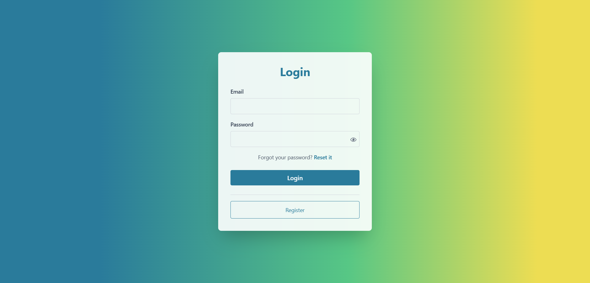
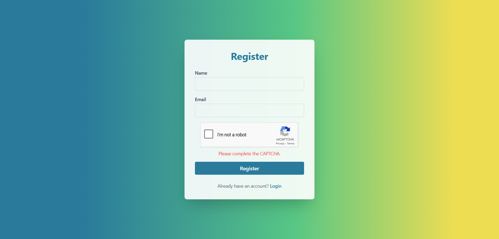
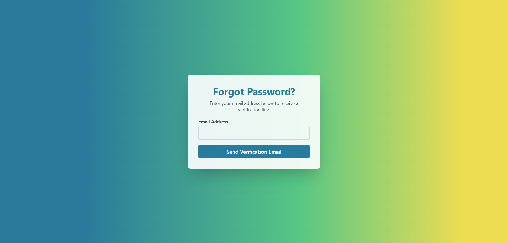
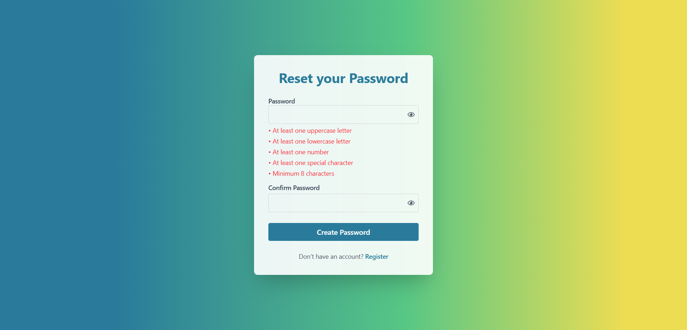
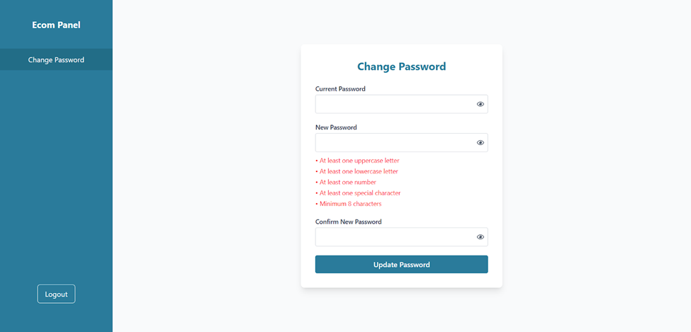

# 🔐 Complete Authentication System

A full-stack authentication system built with modern technologies. This project provides a secure, feature-rich user authentication solution with email verification, password management, and protected routes.

## Screenshots

<p align="center">
   <div>Login Page</div>
  
  <div>Register Page</div>
   
  <div>Captcha</div>
  
  <div>Verify Mail</div> 
  
  <div>Change Password Using Forgot password</div>
  
  <div>Change Password After Login</div>
  

</p>

## 🌟 Features

### 🔒 **Authentication & Security**

- User registration and login
- JWT-based authentication with refresh tokens
- Secure password hashing (bcrypt)
- Account lockout after failed attempts
- Email verification system
- Secure password creation and updates
- **Automatic password expiry (180 days)**
- **Password change enforcement for expired passwords**

### 👤 **User Management**

- User profile management with avatar upload
- Account activation via email tokens
- Password creation and reset functionality
- User profile management
- **Automatic password expiry tracking**
- **Password change history and notifications**

### 💻 **Modern UI/UX**

- Responsive React-based frontend
- TypeScript for type safety
- Modern UI components with Tailwind CSS
- Loading states and user feedback
- Protected route navigation
- Real-time form validation

## 🛠️ Tech Stack

### **Backend (BE)**

- **Runtime**: Node.js
- **Framework**: Express.js 5.1.0
- **Database**: MongoDB with Mongoose
- **Authentication**: JWT (jsonwebtoken)
- **Password Security**: bcrypt
- **Email Service**: Nodemailer
- **Validation**: express-validator
- **Environment**: dotenv

### **Frontend (FE)**

- **Framework**: React 18 with TypeScript
- **Build Tool**: Vite
- **Styling**: Tailwind CSS
- **HTTP Client**: Axios
- **Routing**: React Router DOM
- **State Management**: React Context/Hooks
- **Form Handling**: React Hook Form
- **Icons**: Lucide React

## 📁 Project Structure

```
LoginPage/
├── BE/                                    # Backend Application
│   ├── config/                           # Configuration files
│   │   ├── cloudinary.config.js         # Cloud storage config
│   │   └── mongoose.config.js           # Database configuration
│   ├── router/                           # API routes
│   │   ├── auth.routes.js               # Authentication routes
│   │   └── index.js                     # Route aggregator
│   ├── src/
│   │   ├── controller/                   # Business logic controllers
│   │   │   └── auth.controller.js
│   │   ├── middleware/                   # Express middlewares
│   │   │   ├── authcheck.js             # JWT authentication
│   │   │   ├── uploader.js              # File upload handling
│   │   │   └── validator.js             # Request validation
│   │   ├── modal/                        # Database models
│   │   │   └── auth.modal.js            # User model schema
│   │   ├── services/                     # Business services
│   │   │   ├── auth.service.js          # Authentication logic
│   │   │   └── email.service.js         # Email service
│   │   └── utils/                        # Utility functions
│   │       ├── helper.js                # Helper functions
│   │       └── validator/               # Input validators
│   │           └── auth.validate.js
│   ├── app.js                           # Express app setup
│   └── package.json                     # Backend dependencies
├── FE/                                   # Frontend Application
│   ├── public/                          # Static assets
│   │   └── vite.svg
│   ├── src/
│   │   ├── assets/                      # Images and icons
│   │   │   ├── react.svg
│   │   │   └── spinner.tsx
│   │   ├── component/                   # Reusable components
│   │   │   ├── Input.tsx               # Custom input component
│   │   │   └── PasswordCheckWrapper.tsx
│   │   ├── hooks/                       # Custom React hooks
│   │   │   └── usePasswordStatus.ts
│   │   ├── Pages/                       # Application pages
│   │   │   ├── ChangePassword/         # Password change functionality
│   │   │   │   └── index.tsx
│   │   │   ├── CreatePassword/         # Password creation
│   │   │   │   ├── index.tsx
│   │   │   │   └── successPage.tsx
│   │   │   ├── homepage.tsx/           # Dashboard/Home
│   │   │   │   └── index.tsx
│   │   │   ├── Login/                  # Login page
│   │   │   │   └── index.tsx
│   │   │   ├── Register/               # User registration
│   │   │   │   ├── index.tsx
│   │   │   │   └── successPage.tsx
│   │   │   ├── UpdatePassword/         # Password updates
│   │   │   │   ├── index.tsx
│   │   │   │   └── successPage.tsx
│   │   │   └── VarifyMail/             # Email verification
│   │   │       ├── index.tsx
│   │   │       └── successPage.tsx
│   │   ├── Route/                       # Routing configuration
│   │   │   ├── index.tsx               # Main router
│   │   │   └── protectedRoute.tsx      # Route protection
│   │   ├── utils/                       # Utility functions
│   │   ├── App.tsx                      # Main app component
│   │   ├── main.tsx                     # App entry point
│   │   ├── index.css                    # Global styles
│   │   └── vite-env.d.ts               # Vite environment types
│   ├── eslint.config.js                # ESLint configuration
│   ├── index.html                       # HTML template
│   ├── package.json                     # Frontend dependencies
│   ├── tsconfig.app.json               # TypeScript app config
│   ├── tsconfig.json                    # TypeScript base config
│   ├── tsconfig.node.json              # TypeScript node config
│   └── vite.config.ts                  # Vite configuration
└── README.md                            # Project documentation
```

## 🚀 Getting Started

### **Prerequisites**

- Node.js (v16 or higher)
- MongoDB (local or cloud instance)
- Git

### **Backend Setup**

1. **Navigate to backend directory:**

   ```bash
   cd BE
   ```

2. **Install dependencies:**

   ```bash
   npm install
   ```

3. **Environment Configuration:**
   Create a `.env` file in the BE directory:

   ```env
   DBURL=mongodb://localhost:27017/your-database-name
   JWT_SECRET=your-super-secret-jwt-key
   JWT_REFRESH_SECRET=your-refresh-token-secret
   EMAIL_USER=your-email@gmail.com
   EMAIL_PASS=your-app-password
   CLOUDINARY_CLOUD_NAME=your-cloudinary-cloud-name
   CLOUDINARY_API_KEY=your-cloudinary-api-key
   CLOUDINARY_API_SECRET=your-cloudinary-api-secret
   PORT=5000
   ```

4. **Start the backend server:**
   ```bash
   npm start
   ```

### **Frontend Setup**

1. **Navigate to frontend directory:**

   ```bash
   cd FE
   ```

2. **Install dependencies:**

   ```bash
   npm install
   ```

3. **Start the development server:**

   ```bash
   npm run dev
   ```

4. **Build for production:**
   ```bash
   npm run build
   ```

## 📡 API Endpoints

### **Authentication Routes**

```
POST /v1/auth/register          # User registration
POST /v1/auth/login             # User login
POST /v1/auth/createpassword/:token # Account activation
POST /v1/auth/changepassword    # Password change (requires auth)
POST /v1/auth/updatepassword    # Password update (requires auth)
GET  /v1/auth/password-status   # Check password expiry status
```

## 💾 Database Schema

### **User Model**

```javascript
{
  fullName: String,
  email: String (unique),
  avatar: String (URL),
  status: ["active", "inactive"],
  activationToken: String,
  password: String,
  lastPasswordChange: Date,        // Tracks last password change
  passwordChangeRequired: Boolean, // Flags if password change needed
  createdAt: Date,
  updatedAt: Date
}
```

## 🔐 Security Features

### **Password Security**

- bcrypt hashing with salt rounds
- Password strength validation
- Secure password storage
- **Automatic password expiry (180 days)**
- **Password change enforcement**

### **JWT Authentication**

- Access tokens (short-lived)
- Refresh tokens (long-lived)
- Token validation middleware
- Secure token storage

### **Route Protection**

- Protected routes requiring authentication
- Account lockout after failed login attempts
- Email verification for account activation
- **Automatic password expiry enforcement**
- **Password age tracking and validation**

### **Input Validation**

- Server-side validation using express-validator
- Client-side validation with React Hook Form
- XSS protection
- SQL injection prevention

### **File Upload Security**

- File type validation
- File size limits
- Secure cloud storage (Cloudinary)

### **Environment Security**

- Secure HTTP headers
- Environment variable protection

## 🔄 Password Expiry System

This system implements automatic password expiry functionality to enhance security by ensuring users regularly update their passwords.

### **How Password Expiry Works**

#### **Automatic Expiry (180 Days)**

- Passwords automatically expire 180 days after being set or last changed
- System tracks `lastPasswordChange` date for each user
- Users receive warnings during login when password is approaching expiry

#### **Registration & Activation Flow**

1. User registers → `lastPasswordChange` set to registration date
2. Account activation → `lastPasswordChange` updated to activation date
3. Password creation → `lastPasswordChange` set to current date

#### **Login with Expiry Check**

1. User attempts login
2. Backend calculates days since last password change
3. If ≥180 days, `passwordChangeRequired` flag is set to true
4. Frontend displays warning toast and may redirect to password change

#### **Protected Route Access**

1. User navigates to protected routes (e.g., `/home`)
2. `PasswordCheckWrapper` component checks password status via API
3. If password expired, shows change password form instead of requested page
4. User must change password to continue accessing the application

### **Password Expiry Components**

#### **Backend Implementation**

- **Database Fields**: `lastPasswordChange`, `passwordChangeRequired`
- **API Endpoints**: Password status check and password change
- **Middleware**: JWT verification with password expiry validation
- **Services**: Password age calculation and update handling

#### **Frontend Implementation**

- **usePasswordStatus Hook**: Automatic password status checking
- **PasswordCheckWrapper**: Higher-order component for route protection
- **Enhanced Forms**: Password change with validation and feedback
- **User Notifications**: Toast warnings for password expiry

### **Password Change Process**

1. User enters current password and new password
2. Backend validates current password against stored hash
3. New password is hashed using bcrypt and stored
4. `lastPasswordChange` updated to current date
5. `passwordChangeRequired` flag reset to false
6. User can continue accessing protected routes

### **Security Benefits**

- **Regular Password Updates**: Forces users to change passwords periodically
- **Compromise Mitigation**: Limits exposure time if password is compromised
- **Compliance**: Helps meet security compliance requirements
- **User Awareness**: Keeps password security top-of-mind for users

### **Testing Password Expiry**

To test the password expiry feature:

1. **Create Test Account**: Register and activate a new user
2. **Simulate Expiry**: Update database directly to set old password change date:
   ```javascript
   // MongoDB command to simulate expired password
   db.users.updateOne(
     { email: "test@example.com" },
     {
       $set: {
         lastPasswordChange: new Date(Date.now() - 181 * 24 * 60 * 60 * 1000),
       },
     }
   );
   ```
3. **Test Login**: Login should show password change requirement
4. **Test Protection**: Navigate to protected routes to see password change enforcement

## ⚙️ Advanced Features

### **Password Management**

- **Automatic password expiry (180 days from last change)**
- **Password age tracking and monitoring**
- **Forced password change for expired passwords**
- **Password change history prevention**
- **Real-time password expiry status checking**
- **Customizable password strength requirements**
- **Automated password expiry warnings and notifications**

### **Custom Hooks**

- `usePasswordStatus`: Hook for managing password validation states and expiry checking
- Real-time password strength checking and validation
- Form state management across components
- Password expiry status monitoring and notifications

### **Email Integration**

- Account activation emails
- Password reset notifications
- Welcome emails
- Security alerts

### **Error Handling**

- Comprehensive error handling
- User-friendly error messages
- Logging and monitoring
- Graceful fallbacks

## 🧪 Testing

### **Backend Testing**

```bash
cd BE
npm test
```

### **Frontend Testing**

```bash
cd FE
npm run test
```

### **Build Testing**

```bash
cd FE
npm run build # Test build process
```

## 🔄 User Flows

### **User Registration Flow**

1. User fills registration form
2. Account created with 'inactive' status and `lastPasswordChange` set
3. Activation email sent with token
4. User clicks email link to activate and Create Password account
5. User sets password, `lastPasswordChange` updated to current date
6. Account becomes 'active' with 180-day password expiry countdown

### **Login Flow**

1. User enters credentials
2. Server validates credentials and checks password age
3. If password is ≥180 days old, `passwordChangeRequired` flag is set
4. JWT tokens returned with password status information
5. Frontend stores tokens and shows expiry warning if needed
6. User redirected to dashboard or password change form

### **Password Expiry Flow**

1. User attempts to access protected route
2. `PasswordCheckWrapper` calls password status API
3. If password expired, change password form is displayed
4. User must update password before accessing requested page
5. Upon successful change, user can continue to protected routes

## 🤝 Contributing

1. Fork the repository
2. Create a feature branch (`git checkout -b feature/amazing-feature`)
3. Commit your changes (`git commit -m 'Add some amazing feature'`)
4. Push to the branch (`git push origin feature/amazing-feature`)
5. Open a Pull Request

## 📄 License

This project is licensed under the MIT License - see the [LICENSE](LICENSE) file for details.

## 📞 Support

For support and questions:

- Create an issue in the GitHub repository
- Email: sandeshbhusal417@gmail.com

**Built by Sandesh Bhusal | © 2025**
